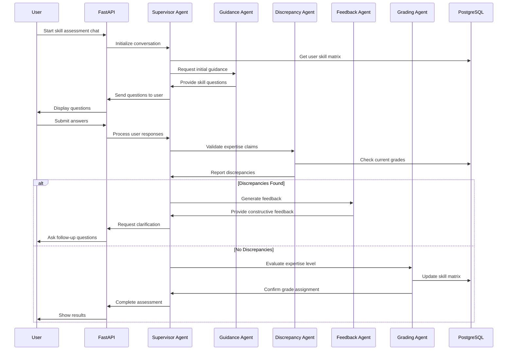
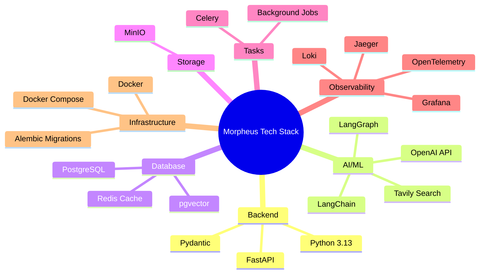

# Morpheus Architecture Diagram

## System Overview

```mermaid
graph TB
    %% User Interface Layer
    User[👤 Engineer/User]
    ChatUI[💬 Chat Interface]
    
    %% API Gateway
    FastAPI[🚀 FastAPI Application<br/>Port: 8000]
    
    %% AI Agent System
    subgraph "AI Multi-Agent System"
        Supervisor[🎯 Supervisor Agent<br/>Orchestrates Flow]
        Guidance[📚 Guidance Agent<br/>Educational Content]
        Discrepancy[🔍 Discrepancy Agent<br/>Validates Claims]
        Feedback[💡 Feedback Agent<br/>Constructive Feedback]
        Grading[📊 Grading Agent<br/>Expertise Evaluation]
        Evasion[🛡️ Evasion Detector<br/>Detects Avoidance]
    end
    
    %% Core Services
    subgraph "Core Services"
        SkillMatrix[📋 Skill Matrix Service]
        Assessment[🎯 Assessment Service]
        Notification[📧 Notification Service]
        Analytics[📈 Analytics Service]
    end
    
    %% Data Layer
    subgraph "Data Storage"
        PostgreSQL[(🐘 PostgreSQL<br/>+ pgvector)]
        Redis[(🔴 Redis Cache)]
        MinIO[(📦 MinIO<br/>File Storage<br/>Port: 9001)]
    end
    
    %% External Services
    subgraph "AI/ML Services"
        OpenAI[🤖 OpenAI API]
        LangChain[🔗 LangChain]
        LangGraph[📊 LangGraph]
        Tavily[🔍 Tavily Search]
    end
    
    %% Background Processing
    subgraph "Background Tasks"
        Celery[⚙️ Celery<br/>Task Queue]
        CeleryWorker[👷 Celery Workers]
    end
    
    %% Observability Stack
    subgraph "Observability & Monitoring"
        OpenTelemetry[📡 OpenTelemetry]
        Jaeger[🔍 Jaeger Tracing<br/>Port: 16686]
        Grafana[📊 Grafana Dashboard<br/>Port: 3000]
        Loki[📝 Loki Logs]
    end
    
    %% User Flow
    User --> ChatUI
    ChatUI --> FastAPI
    
    %% API to Agents
    FastAPI --> Supervisor
    Supervisor --> Guidance
    Supervisor --> Discrepancy
    Supervisor --> Feedback
    Supervisor --> Grading
    Supervisor --> Evasion
    
    %% Agents to Services
    Guidance --> SkillMatrix
    Discrepancy --> Assessment
    Feedback --> Analytics
    Grading --> SkillMatrix
    
    %% Services to Data
    SkillMatrix --> PostgreSQL
    Assessment --> PostgreSQL
    Notification --> Redis
    Analytics --> PostgreSQL
    
    %% Background Tasks
    FastAPI --> Celery
    Celery --> CeleryWorker
    CeleryWorker --> Notification
    
    %% AI Services
    Supervisor --> OpenAI
    Guidance --> OpenAI
    Discrepancy --> OpenAI
    Feedback --> OpenAI
    Grading --> OpenAI
    Evasion --> OpenAI
    
    Supervisor --> LangChain
    LangChain --> LangGraph
    Discrepancy --> Tavily
    
    %% File Storage
    FastAPI --> MinIO
    
    %% Observability
    FastAPI --> OpenTelemetry
    Supervisor --> OpenTelemetry
    Guidance --> OpenTelemetry
    Discrepancy --> OpenTelemetry
    Feedback --> OpenTelemetry
    Grading --> OpenTelemetry
    
    OpenTelemetry --> Jaeger
    OpenTelemetry --> Grafana
    OpenTelemetry --> Loki
    
    %% Styling
    classDef userLayer fill:#e1f5fe
    classDef apiLayer fill:#f3e5f5
    classDef agentLayer fill:#e8f5e8
    classDef serviceLayer fill:#fff3e0
    classDef dataLayer fill:#fce4ec
    classDef aiLayer fill:#f1f8e9
    classDef taskLayer fill:#e0f2f1
    classDef obsLayer fill:#f9fbe7
    
    class User,ChatUI userLayer
    class FastAPI apiLayer
    class Supervisor,Guidance,Discrepancy,Feedback,Grading,Evasion agentLayer
    class SkillMatrix,Assessment,Notification,Analytics serviceLayer
    class PostgreSQL,Redis,MinIO dataLayer
    class OpenAI,LangChain,LangGraph,Tavily aiLayer
    class Celery,CeleryWorker taskLayer
    class OpenTelemetry,Jaeger,Grafana,Loki obsLayer
```

## Agent Interaction Flow

```mermaid
sequenceDiagram
    participant U as User
    participant API as FastAPI
    participant S as Supervisor Agent
    participant G as Guidance Agent
    participant D as Discrepancy Agent
    participant F as Feedback Agent
    participant GR as Grading Agent
    participant DB as PostgreSQL
    
    U->>API: Start skill assessment chat
    API->>S: Initialize conversation
    S->>DB: Get user skill matrix
    S->>G: Request initial guidance
    G->>S: Provide skill questions
    S->>API: Send questions to user
    API->>U: Display questions
    
    U->>API: Submit answers
    API->>S: Process user responses
    S->>D: Validate expertise claims
    D->>DB: Check current grades
    D->>S: Report discrepancies
    
    alt Discrepancies Found
        S->>F: Generate feedback
        F->>S: Provide constructive feedback
        S->>API: Request clarification
        API->>U: Ask follow-up questions
    else No Discrepancies
        S->>GR: Evaluate expertise level
        GR->>DB: Update skill matrix
        GR->>S: Confirm grade assignment
        S->>API: Complete assessment
        API->>U: Show results
    end
```

## Expertise Levels

```mermaid
graph LR
    L1[1. Not Informed<br/>❌ No Knowledge]
    L2[2. Informed Basics<br/>📖 Basic Concepts]
    L3[3. Informed Details<br/>🎯 Strategic Understanding]
    L4[4. Practice & Lab<br/>🧪 Practical Application]
    L5[5. Production Maintenance<br/>⚙️ Prod Environment]
    L6[6. Production from Scratch<br/>🏗️ Full System Setup]
    L7[7. Educator/Expert<br/>🎓 Teaching & Leadership]
    
    L1 --> L2 --> L3 --> L4 --> L5 --> L6 --> L7
    
    classDef level1 fill:#ffebee
    classDef level2 fill:#fff3e0
    classDef level3 fill:#f3e5f5
    classDef level4 fill:#e8f5e8
    classDef level5 fill:#e1f5fe
    classDef level6 fill:#f1f8e9
    classDef level7 fill:#e0f2f1
    
    class L1 level1
    class L2 level2
    class L3 level3
    class L4 level4
    class L5 level5
    class L6 level6
    class L7 level7
```

## Technology Stack

```mermaid
mindmap
  root((Morpheus Tech Stack))
    Backend
      FastAPI
      Python 3.13
      Pydantic
    AI/ML
      LangChain
      LangGraph
      OpenAI API
      Tavily Search
    Database
      PostgreSQL
      pgvector
      Redis Cache
    Storage
      MinIO
    Tasks
      Celery
      Background Jobs
    Observability
      OpenTelemetry
      Jaeger
      Grafana
      Loki
    Infrastructure
      Docker
      Docker Compose
      Alembic Migrations
```